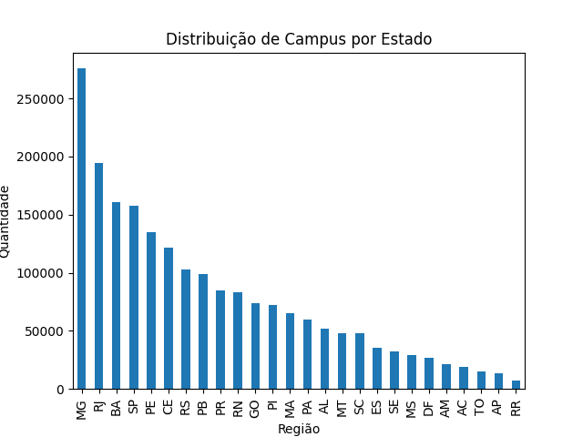
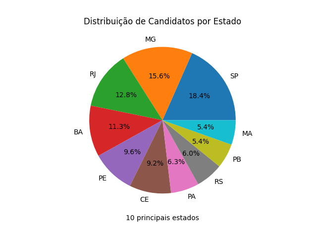

# 📊 Análise MEC

**Análise MEC** é um projeto em Python desenvolvido em ambiente Jupyter Notebook, com foco na análise exploratória de dados a partir de um arquivo do Ministério da Educação (MEC). O objetivo é extrair insights relevantes e praticar habilidades de manipulação de dados utilizando **pandas** e técnicas de leitura de planilhas Excel.

---

## 💼 Propósito do Projeto

Este projeto foi criado com o intuito de:
- Praticar análise de dados utilizando **Python e Jupyter Notebook**
- Explorar dados educacionais fornecidos pelo **MEC**
- Trabalhar com leitura, limpeza e manipulação de arquivos `.xlsx`
- Aplicar técnicas de **análise exploratória de dados (EDA)** para identificar padrões e insights relevantes

---

## 🛠️ Tecnologias Utilizadas

- **Python 3.x**
- **Jupyter Notebook**
- **Pandas** — para manipulação e análise de dados
- **OpenPyXL** ou **xlrd** — para leitura de arquivos Excel
- **Matplotlib** e/ou **Seaborn** — para visualização de dados (caso aplicável)

---

## 🤝 Contato

Fique à vontade para entrar em contato:

- LinkedIn: [Gabriela R. M. Soares](https://www.linkedin.com/in/gabrielarmsoares/)

---

## 📊 Visualizações

*Figura 1: Distribuição dos campi por estado.*

*Figura 2: Distribuição dos cursos.*
